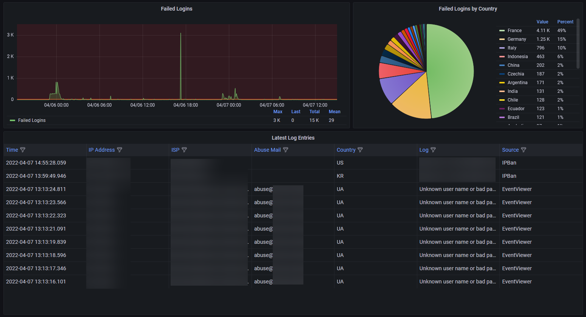

# InfluxDB Plugin

The InfluxDB Plugin processes the collected reports and sends them to an InfluxDB instance.

## Example Dashboard

[16097 on Grafana.com](https://grafana.com/grafana/dashboards/16097)

[](https://grafana.com/grafana/dashboards/16097)


## Configuration

### InfluxUrl (string)

The URL of the InfluxDB instance. (Needs to be a HTTP URL ex. http://localhost:8086)

### InfluxDbUser (string)

The username for the InfluxDB instance.

### InfluxDbPassword (string)

The password for the InfluxDB instance.

## Example Configuration

```json
{
	"InfluxUrl": "http://localhost:8086",
	"InfluxDbName": "data",
  "InfluxDbUser": "root",
  "InfluxDbPassword": "root",
}
```